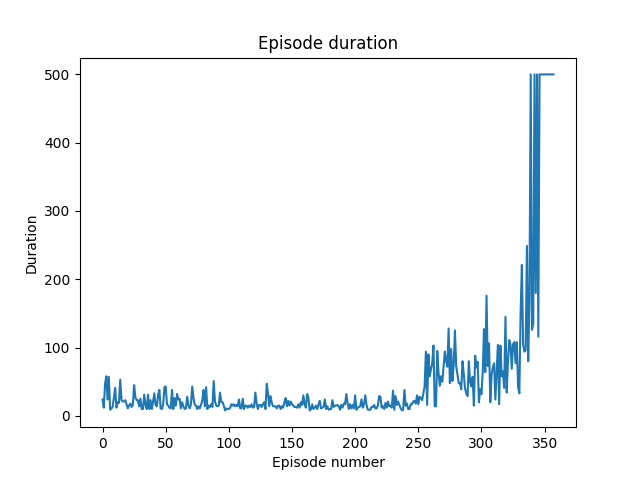
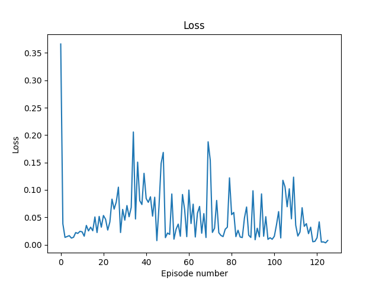
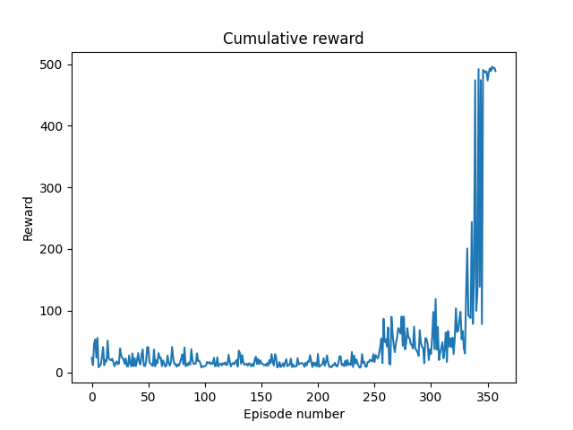
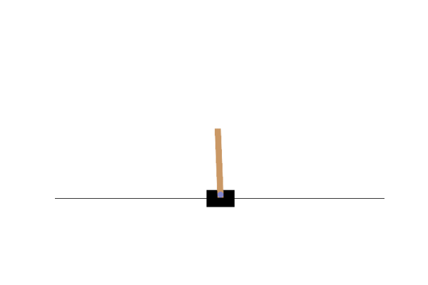

# Experiments in Double Deep-Q Networks (Double DQN)

Deep-Q networks are an approach in reinforcement learning where the goal is to learn the "value" of the network being in a given state in the environment it is being trained in. These values take into account the future reward-earning potential of states and the aim of the DQN is to learn an approximation of this _state-action value function_ (Q-function) $Q(s_t, a_t)$.

DQN methods are notoriously unstable and difficult to train. Unlike many other fields of machine learning where the data is assumed to be IID, the environments used to train RL agents return a continuous stream of inputs that are highly temporarily correlated. In DQN methods, this is overcome by introducing a _replay buffer_ that is built up and maintained during training, but training nevertheless reamins unstable. In order to stabilise the training process, this implementation employs a number of features:

- _Double DQN_: In a standard DQN setup with only a single network, both the action and the Q-values are computed by the same network. This introduces a strong correlation between the temporal difference (TD) target and parameters being trained. That is, at every step of the training, the Q-value are updated but the target values also shift making the training unstable. A double DQN setup tries to stabilise this by training a separate target network for computing the TD target, which is only updated slowly. The policy network's training is then decorrelated by using the target network's replay memory.
- _Soft update_: instead of a hard update of the target network every $n$ steps, we opt for a soft update of the network, controlled by a parameter $\tau$

  $$
  \theta_{\text{target}} = (1 - \tau) \cdot \theta_{\text{target}} + \tau \cdot \theta_{\text{policy}}
  $$

- _Huber loss_: a more robust metric for computing the TD error than L2 loss
  $$
  L_\text{Huber}(x, y; \delta) =
  \begin{cases}
  \frac{1}{2} {\left( x_n - y_n \right)}^2, \qquad \text{ for } |x_n - y_n| \lt \delta,\\
  \delta \cdot \left(|x_n - y_n| - \frac{1}{2} \delta \right), \qquad \text{ otherwise.}
  \end{cases}
  $$
- _Double replay memory_: in a normal DQN, a single replay memory is used to store the learned experiences. However, later in the training, when the memory is saturated by 'good' experiences, the network can forget how to react to unfavourable conditions, leading to _catastrophic forgetting_. To combat this, this implementation retains a secondary warmup memory, which is populated with experiences from early on in the training. A small fraction of these 'bad' experiences are then injected into the experiences sampled from the memory.

## Can a Bloom filter improve exploration?

### Proposal

The script `./scripts/cartpole_v1.py` experiments with trying to improve the efficiency of exploration by introducing a Bloom filter to keep track of what eploration the agent has already tried.

If it is determined that the agent has already taken the same sampled action during exploration, then the network is encouraged (though not forced) to choose another action from the same state. A Bloom filter is used in place of a standard set for its light memory footprint. As the complexity of the environemtn increases, it becomes less tenable to maintain an exact registry of past decisions.

A similar idea called _prioritized experience replay_ (PER) has already been proposed, wherein sampling from past experience is weighted by how 'important' each experience is (as opposed to a naive uniform sampling).

The proposed approach here is complimentary to PER; whereas PER modifies the distribution of sampling of existing experience, this extension tries to modify the variety of the distribution by increasing the efficiency of the exploration step.

### Setup

This experiment is set to the classic cartpole problem where an agent is trained to move to keep a pole attached to the cart balanced vertically. However we modify the evnironment slightly by adding a small penalty
$$r = - \min(10 x^2, 1), \qquad -1.2 \leq x \leq 1.2,$$
to the reward awarded by the environment ($x$ is the x-position of the cart). This is to encourage the cart to stay in the center of the field of view, as otherwise the cart can drift slowly to the sides and still score 500 points.

### Usage

A model can be trained from scratch with or without a Bloom filter by passing the flag `--use-bloom`:

```bash
python ./scripts/cartpole_v1.py
```

or

```bash
python ./scripts/cartpole_v1.py --use-bloom
```

The resulting model can then be evaluated with

```bash
python ./scripts/cartpole_v1.py --eval
```

### Results

A sample of training output is provdied below. The first plot is the cumulative reward that the agent received during each training episode (max 500). The second plot is the loss after sufficient experience had been gathered.



    Note that there is an initial warmup phase of about 200 episodes where experience is gathered and added to the warmup memory, but the network weights are not trained (making this phase very quick). This is followed by about 30 or so episodes of populating the main memory and so it is only after ~230 episodes that the network start learning and the losses can be plotted.

Unlike the default cartpole problem, where the agent receives one unit of reward per frame that it survives without being terminated, we use the modified reward scheme discussed above, and so plot the reward earned separately:


Though not very interesting, we provide a GIF of a sample run after training for completeness:


In order to determine whether a Bloom filter can improve the efficiecy of training, multiple networks were trained with and without a Bloom filter and the time to first max-out (number of episodes until the agent hit the maxmium 500 steps in a single epsiode) was recorded.

Taking an average of 10 independent training sessions each gave an average of 88 epsiodes to train the agent with a Bloom filter and 95 epsiodes without (after subtracting off 230 episodes of pre-training).

This obviously comes at the cost of extra computational power required to compute the hashes for the Bloom filter.

Whilst the effect of this addition is relatively small, it should be possible to combine this with PER, for example, to further improve the efficieny of training.
